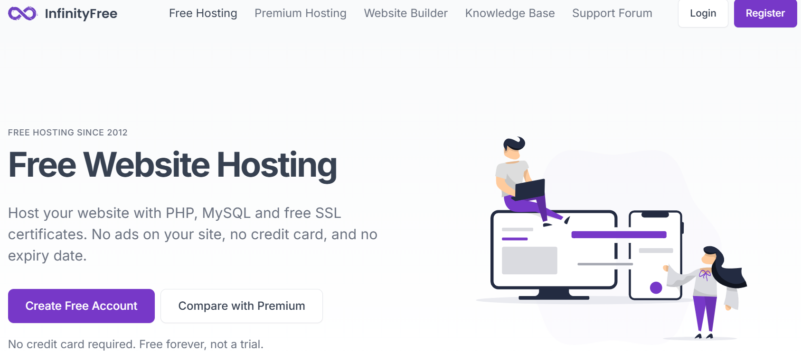
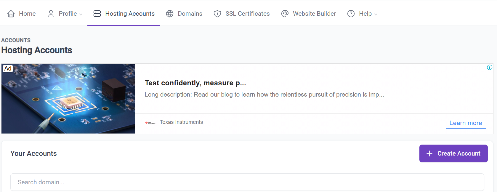
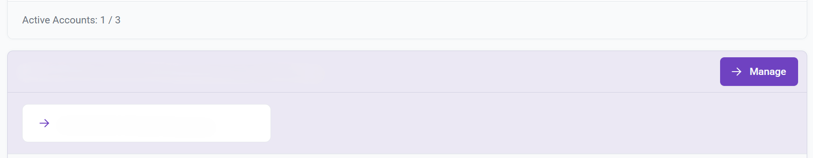
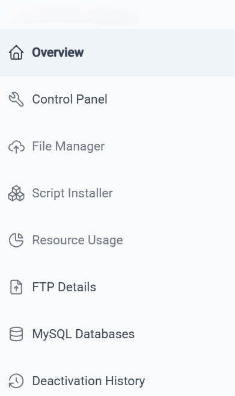
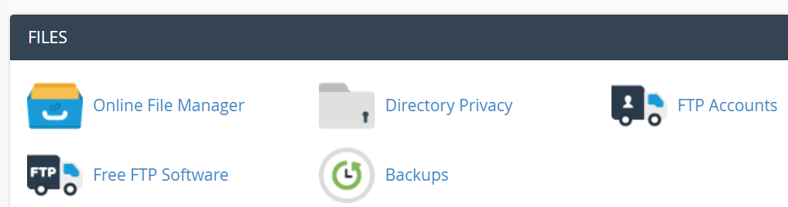
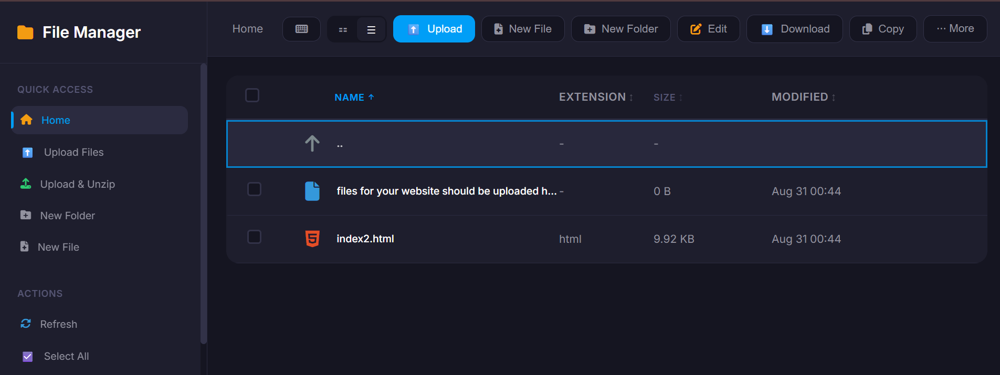

# InfinityFree - a Web Hosting Platform
## Create an Account
- Create Free Account or Login if you already have an account.

## Create Hosting Account and Subdomain
- On `Hosting Accounts` tab, click `+ Create Account`

- Set your Hosting Account and Subdomain

## Go to the File Manager
- On `Hosting Accounts` tab, find your hosting account and click `-> Manage`

- On `Overview`, click `Control Panel`

- Go to `Files` and click `Online File Manager`

- Here is the `Online File Manager`
