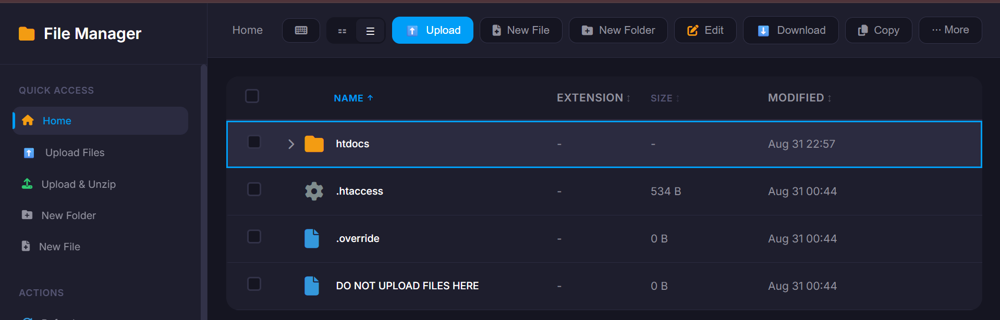

# Website Hosting
- Host HTML and CSS files using InfinityFree
## Upload files
1. Go to `InfinityFree.com` and login

2. Go to `Hosting Accounts` tab

3. Select an account and click `-> Manage`

4. Go to `File Manager`

5. Go to `.htdocs`

6. Delete the pre-installed files inside
7. Upload the files for your website

## Testing
- Enter the URL of your domain using another device 
- Visit the website and test functionalities