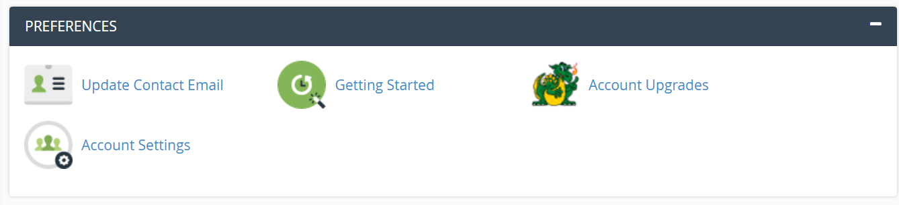
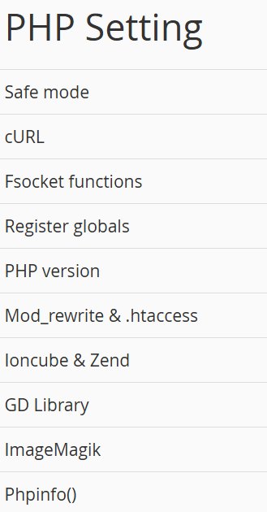

# Check PHP Version
1. Go to `InfinityFree.com` and login

2. Go to `Hosting Accounts` tab

3. Select an account and click `-> Manage`

4. On `Overview`, select `Control Panel`

5. On `Preferences`, click `Account Settings`

6. Scroll down to `PHP Setting`
